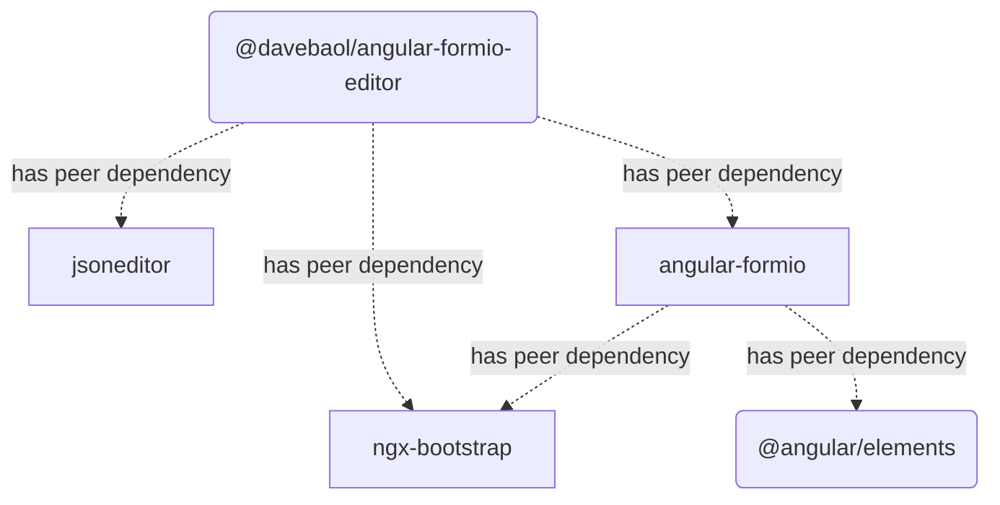

# Angular Form.io Editor Component

[](https://badge.fury.io/js/%40davebaol%2Fangular-formio-editor) [](https://travis-ci.com/davebaol/angular-formio-editor) [](https://david-dm.org/davebaol/angular-formio-editor) [](https://david-dm.org/davebaol/angular-formio-editor?type=dev) [](https://opensource.org/licenses/MIT)

This Angular component provides [Form.io](https://www.form.io/) builder and renderer integrated with json editor. 

It works with latest Angular 9.

Example:

```html
<formio-editor [form]="form" [options]="options"></formio-editor>
```

## Try the Live Demos: [Demo Dev](https://davebaol.github.io/angular-formio-editor/) and [Demo Stable](https://davebaol.github.io/angular-formio-editor-demo/)

In case the live demo goes down for whatever reason, the component is supposed to look somewhat like this (click any image to enlarge it):
<table>
<tr>
    <td><a target="_blank" href="https://user-images.githubusercontent.com/2366334/81509000-d8d34500-9307-11ea-8d0d-a7cf2da5c7c0.png"></a></td>
    <td><a target="_blank" href="https://user-images.githubusercontent.com/2366334/81509005-e5f03400-9307-11ea-9c26-61b027f4062d.png"></a></td>
</tr>
<tr>
    <td><a target="_blank" href="https://user-images.githubusercontent.com/2366334/81509007-e983bb00-9307-11ea-864f-3a0cdbe8192c.png"></a></td>
    <td><a target="_blank" href="https://user-images.githubusercontent.com/2366334/81509008-edafd880-9307-11ea-8485-ee82ac05e248.png"></a></td>
</tr>
</table>

## Installation

To install this library with npm, run below command:
```
$ npm install --save angular-formio jsoneditor ngx-bootstrap @angular/elements @davebaol/angular-formio-editor
```
Yes, you have to install 5 packages!!! :scream:

<details>
  <summary>Open this spoiler to see the peer dependencies graph. :wink:</summary>
  
<p align="center">
  
</p>
<!--

-->

</details>


## Usage

To use this component in your Angular application follow the steps below:

:one: Import Angular module `FormioEditorModule` as below:

```ts
import { FormioEditorModule } from '@davebaol/angular-formio-editor'; 

@NgModule({
  declarations: [
    AppComponent
  ],
  imports: [
    ....,
    FormioEditorModule
  ],
  providers: [],
  bootstrap: [AppComponent]
})
export class AppModule { }
```
:two: Setup your component models as below:

```ts
import { Component } from '@angular/core';
import { FormioEditorOptions } from '@davebaol/angular-formio-editor';

@Component({
  selector: 'app-root',
  template: `
    <div class="content" role="main">
      <div class="col-10 m-4">
        <formio-editor [form]="form" [options]="options"></formio-editor>
      </div>
    </div>
  `,
  styleUrls: ['./app.component.css']
})
export class AppComponent {
  form: any;
  options: FormioEditorOptions;

  constructor() {
    this.form = {
      display: 'form',
      components: []
    };
    this.options = {
      tabs: ['builder', 'json', 'renderer'], // set allowed tabs
      tab: 'builder', // set default tab
      builder: {
        hideDisplaySelect: true
      },
      json: {
        changePanelLocations: ['top', 'bottom'],
        editor: {
          modes: ['code', 'tree', 'view'], // set allowed modes
          mode: 'view' // set default mode
        }
      }
    };
  }
}
```
:three: For better styling, add the lines below to your main style.css file
```css
@import "./styles/bootstrap/css/bootstrap.min.css";
@import '~font-awesome/css/font-awesome.min.css';
@import "~jsoneditor/dist/jsoneditor.min.css";
@import "~@davebaol/angular-formio-editor/styles.css";
```
Note that this library only needs the `.css` from bootstrap, not the `.js`, since `ngx-bootstrap` is used internally.
So you don't have necessarily to add bootstrap and its peer dependency jQuery.

:four: Troubleshooting

- If during `ng build` execution you encounter this error
  ```
  Generating ES5 bundles for differential loading...
  An unhandled exception occurred: Call retries were exceeded
  ```
  make sure you're using node 12+. If this does not work for you then try the other possible solutions mentioned [here](https://github.com/angular/angular-cli/issues/15493).

## Documentation

The component supports the input arguments `form`, `option` and `reset` described below.

### form
This is a regular form defined by the form.io framework. The component modifies this argument in place. 

### options
The options to configure the component are described below. Be aware that options are only intended as a component setup at creation-time.
```javascript
{
  // The allowed tabs to show inside the component.
  // Defaults to ['builder', 'json', 'renderer'] 
  tabs: ['builder', 'json', 'renderer'],

  // The tab active at component startup. Defaults to 'builder' 
  tab: 'builder',
  
  // Builder tab options 
  builder: {
    // Whether to hide or not the embedded select to change the form display 
    hideDisplaySelect: false
  },

  // Json tab options 
  json: {
    // The locations relative to the json editor where to show the panel
    // for applying json changes to the form. Defaults to ['top', 'bottom']
    changePanelLocations: ['top', 'bottom'],

    // Json editor options 
    editor: {
      // Whether to expand or not all nodes in tree mode. This is
      // an additional option not supported by the original jsoneditor.
      expandAll: false,

      // Other options supported by the original jsoneditor.
      // See jsoneditor API documentation at the link below
      // https://github.com/josdejong/jsoneditor/blob/master/docs/api.md#configuration-options
      ...
    }
  }
}
```

## License

This project is licensed under the **MIT License** - see the [LICENSE](LICENSE) file for details.

